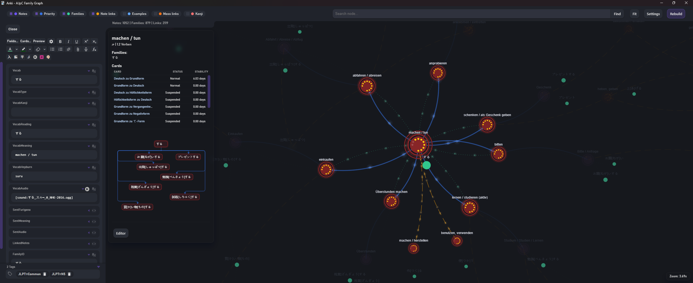
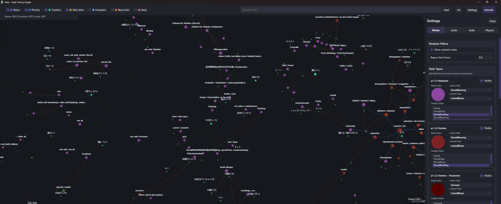

# AJpC Tools Graph

AJpC Tools Graph is a visual companion for the AJpC Tools add-on. It reads your **Family Gate**, **Example Gate**, **Kanji Gate**, and **Linked Notes (Note Linker)** configuration and renders them as an interactive graph.

> **Required:** This add-on only works together with **AJpC Tools**. It pulls data through the Tools add-on API and will not work on its own.




## How it works (overview)
- **Nodes = Anki notes**, **Edges = relationships** defined by AJpC Tools.
- **Family Gate** creates clusters (families) based on your FamilyID field and priorities.
- **Example Gate** connects vocab notes to example notes.
- **Kanji Gate** connects vocab notes to Kanji notes (and optionally parts if enabled).
- **Linked Notes** shows manual and auto-links (Anki Note Linker style tags/fields).
- **Link Core providers** are fetched from AJpC Tools as resolved link edges and rendered on **dynamic per-provider layers** (except Family, which keeps its dedicated graph-family pipeline).

## Open the graph
- `AJpC -> Show Graph`

## UI tour
### Top toolbar
- **Layer toggles** (click the label):
  - Family Hubs, Family Gate, Linked Notes, Example Gate, Kanji Gate, Show Unlinked.
- **Deck selector** (multi-select): filter which decks are included in the graph.
- **Search**: type to get suggestions, press Enter to zoom to the first match (without replacing the active selection). A short ping highlight is shown on the focused node.
- **Settings**: opens a right-side panel with tabs.
- **Rebuild**: full re-read of the data.
- **Live note changes**: note edits/adds use incremental delta slices and patch the running graph without a full frontend rebuild in normal cases. Delta apply does not re-run solver config/physics reinit per event, and simple note edits no longer auto-focus/auto-zoom the graph camera. Family Gate config for build + context mutations is parsed through one shared backend helper path.

### Settings panel
**Note Settings**
- Per note type: visibility, label field (Name), linked field, tooltip fields, and color.

**Link Settings**
- Flow speed (global)
- Trailing Hub Distance (shortens family-hub links when a hub has only one attached node)
- Link metric mode + direction (None, Jaccard, Overlap, Common Neighbors, Clustering Coeff, 2-Hop)
- Per layer:
  - Line Strength (visual link width)
  - Weight Factor (multiplier applied to layout link distance)
- Provider-backed link layers are created dynamically (e.g. `provider_mass_linker`) and appear automatically in Link Settings.
- Chain family levels (hub -> prio chain)
- Per layer: color, line style, flow on/off
- Same-priority links toggle + opacity
- Auto-link opacity
- Kanji parts style options (if enabled)

**Physics**
- D3 solver controls including alpha/cooling, warmup/cooldown, charge, link, and center forces.

## Examples
### Family Gate

- **kita** has: kita at priority 0 (kita or kita@0)
- **deguchi** has: deguchi at priority 0 (deguchi or deguchi@0)
- **~guchi** has: deguchi at priority 1 (deguchi@1)
- **kita-guchi** has: kita at priority 1 and deguchi at priority 2 (kita@1; deguchi@2)

The graph shows two hubs (kita and deguchi) and connects members directly to their hub. So **kita** and **kita-guchi** connect to the **kita** hub, while **deguchi**, **~guchi**, and **kita-guchi** connect to the **deguchi** hub.  
When **Chain family levels** is enabled, chain edges are added by priority: **kita-guchi** connects to **~guchi** and **kita**; **kita** connects to the **kita** hub; **~guchi** connects to **deguchi**, and **deguchi** connects to the **deguchi** hub.

### Linked Notes
If your Linked Notes field contains:

```
[Cause|nid1769835143461]
```

The graph shows a directional link from the current note to that note. If two notes link to each other, you'll see a single line with bidirectional flow.

### Kanji Gate
Vocab notes that contain kanji will connect to the Kanji notes for those characters. You can hide Kanji parts or show them only for the currently selected Kanji.

## Interaction tips
- **Left-click** a node to highlight its direct neighborhood.
- **Right-click** a node for actions:
  - Open Preview
  - Open Editor (embedded native Anki editor in the left graph panel)
  - Filter by Family ID
  - Connect to selected (Family): adds the selected family to the right-clicked note. If the selected item is a **Family Hub**, the new entry is added with prio 0. If the selected item is a **note**, the new entry is added with prio = (selected note prio + 1).
  - Append link to selected: appends a link into the right-clicked note, pointing to the currently selected note (only if that note type has a Linked Notes field configured)
- **Browser context menu**: right-click a note row in Anki Browser and use **Show in AJpC Graph** to open the graph and focus that note.
- Active selection gets a pulsing ring in node color.
- Context selection (right-click target) gets a red pulsing ring.
- Editor button in the active panel toggles the embedded native editor (no extra popup required).
- Embedded editor web controls provide `DevTools`, `Reload CSS`, and `Close`.
- Closing from inside the embedded native editor also closes the left editor sidebar state in the graph UI.

## Notes
- The graph reflects your **AJpC Tools config**, so if the config changes, the graph changes.
- All actions are visual only, except the context actions that explicitly write to your notes.

## Frontend architecture (dev)
- Runtime entry points:
  - `window.ajpcGraphInit(data)`
  - `window.ajpcGraphUpdate(data)`
  - `window.ajpcGraphDelta(slice)`
- Frontend runtime is split into prefixed modules under `web/graph.*.js`:
  - `graph.state.js`, `graph.bridge.js`, `graph.adapter.js`, `graph.utils.js`, `graph.payload.js`
  - `graph.flow.js`, `graph.engine.sigma.js`, `graph.data.graphology.js`
  - `graph.solver.d3.js`, `graph.renderer.sigma.js`
  - `ui/graph.ui.deptree.js`, `ui/graph.ui.debug.js`, `ui/graph.ui.tooltip.js`, `ui/graph.ui.ctx.js`, `ui/graph.ui.editor.js`
  - `graph.ui.js`, `graph.main.js`
- Module boundaries and load order are documented in `.devdocs/ARCHITECTURE_GUIDE.md`.
- Engine runtime is now `sigma.js` via local asset `web/libs/sigma.min.js`.
- Engine runtime implementation is in `web/graph.engine.sigma.js`.
- Delta runtime is split into:
  - Python slice builder `build_note_delta_slice(...)` (`graph_data.py`)
  - JS diff/state patch (`prepareDeltaSlice`, `buildDeltaOps`, `applyDeltaOpsToState` in `web/graph.payload.js`)
  - Engine graphology patch port (`applyGraphDeltaOps` in `web/graph.engine.sigma.js`)
- `window.ajpcEngineSettings` is split into `engine`, `solver`, and `renderer` groups for runtime UI injection.
- Runtime settings are persisted with grouped hooks (`solver:*`, `renderer:*`, `engine:*`, `node:*`).
- Active layout solver is `d3-force` (`web/libs/d3-force.min.js`) via `web/graph.solver.d3.js`.
- Custom post-pass collision/noverlap is removed from the active FA2 runtime path.
- `web/graph.flow.js` drives the shader flow animation loop and frame requests.
- Node ping/ring effects are rendered in Sigma node shaders (`web/sigma-programs/graph.sigma.program.extra.nodefx.js`).
- Flow particles are rendered directly in Sigma edge shaders (`web/sigma-programs/graph.sigma.program.edge.*.js`).
- Bidirectional links render two-way shader photons on one collapsed edge (`ajpc_bidir` attribute path).
- Flow visibility is interaction-gated (hover/active selection), not globally enabled on all visible edges.
- Hub dimming during active focus is handled in the hub node shader (`web/sigma-programs/graph.sigma.program.node.hub.js`).
- Ping/ring effects scale with camera ratio in the same render pass as nodes (no canvas drift).
- The graph window hosts a native embedded Anki editor panel (Qt side) that can be toggled from the graph UI.
- Python host runtime is split into dedicated modules (`graph_launcher.py`, `graph_view.py`, `graph_sync.py`, `graph_bridge_handlers.py`, `graph_actions.py`, `graph_note_ops.py`, `graph_api_adapter.py`, `graph_web_assets.py`, `graph_previewer.py`, `graph_editor_embedded.py`, `graph_editor_window.py`).
- Embedded editor theming source:
  - `web/scss/_graph.editor.scss` (scoped under `#editor-anki`).
  - `graph_editor_embedded.py` injects compiled scoped rules from `web/graph.css` into embedded editor webviews.
- Styling source can be maintained in SCSS:
  - Entry file: `web/graph.scss`
  - Partials: `web/scss/_graph.*.scss`
  - Runtime file remains `web/graph.css` (loaded by Anki webview).
- Engine migration planning sheet:
  - `.devdocs/ENGINE_FEATURE_SHEET.md` (Sigma.js vs AntV G6 vs Cytoscape.js against AJpC feature requirements)

## External Resources:
Icon: Knowledge Graph (CC0) - source: https://www.svgrepo.com/svg/451006/knowledge-graph
---

## Third-Party Licenses
- `web/libs/sigma.min.js` — see `third_party/sigma/LICENSE`
- Sigma project: `sigma.js` (MIT)
- Legacy bundled asset (currently not active runtime): `web/cosmos-graph.min.js` — see `third_party/cosmos/LICENSE`
See `THIRD_PARTY_NOTICES.md` for a summary.

## License
MIT — see `LICENSE`.
